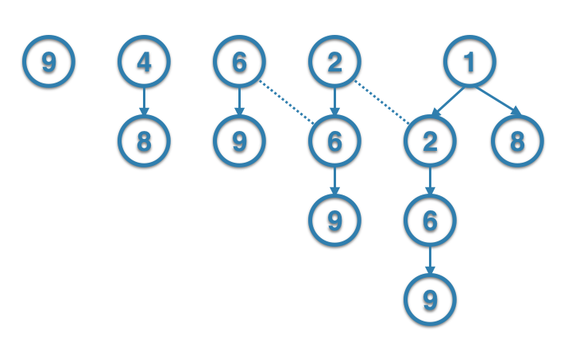

Question - original [post](https://leetcode.com/problems/longest-increasing-path-in-a-matrix/)
----------------------------------------------------------------------------------------------

Given an integer matrix, find the length of the longest increasing path.

From each cell, you can either move to four directions: left, right, up or down. You may NOT move diagonally or move outside of the boundary (i.e. wrap-around is not allowed).

**Example 1:**

```
nums = [[9,9,4],
         ^
        [6,6,8],
         ^
        [2,1,1]]
         ^ ^
```

Return `4`
The longest increasing path is `[1, 2, 6, 9]`.

**Example 2:**

```
nums = [[3,4,5],
         ^ ^ ^
        [3,2,6],
             ^
        [2,2,1]]
```

Return `4`
The longest increasing path is `[3, 4, 5, 6]`. Moving diagonally is not allowed.

Solution - [link](answer.py)
----------------------------

The strategy is to do **Path Finding** algorithms (`DFS`, `BFS`, ...)
to every element. In order to make the path-finding process faster, you could apply the memorization technique from Dynamic Programming to it.

For example:

```
[[9,9,4],
 [6,6,8],
 [2,1,1]]
```

Graph of going through the possible paths:



We can directly use the outcome from the previous visited paths. e.g: The `6->9` path was visited when searching the `2->6->...` path. That's why we need to memorize the visited paths.

Eventually, the problem is a composite problem of **Path Finding** and **Dynamic Programming**.


