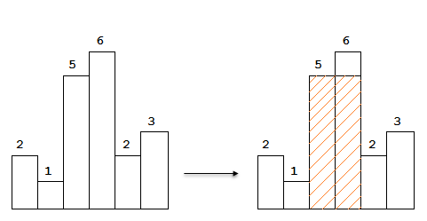
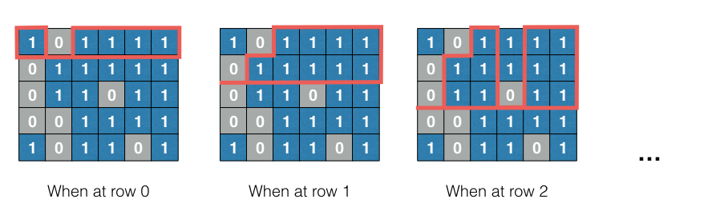
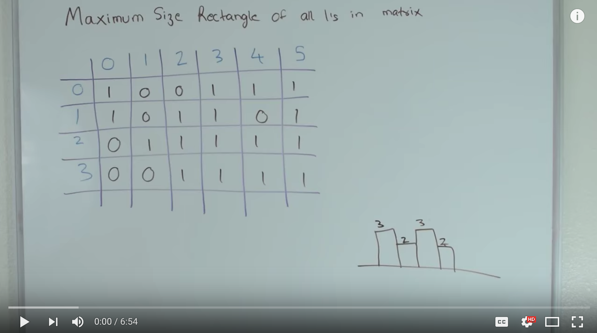
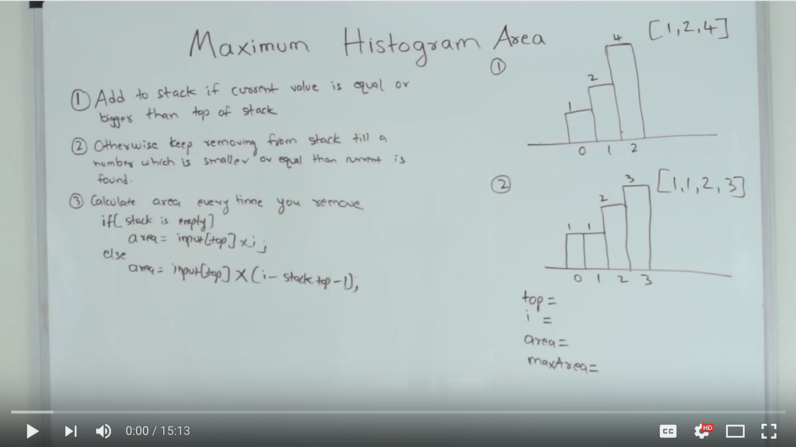

Question - [post](https://leetcode.com/problems/maximal-rectangle/)
--------

Given a 2D binary matrix filled with 0's and 1's, find the largest rectangle containing all ones and return its area.

#### Example 1:

```
["10100",
 "10111",
 "11111",
 "10010"
```

Return `6`

#### Example 2:

```
["101111",
 "011111",
 "011011",
 "001111",
 "101100"]
```

Return `8`

#### Example 3:

```
["1111",
 "1111",
 "1111"
```

Return `12`

---

Solution - [code](answer.py)
--------

Given a navigation that goes through the elements from the left-top one to the right-bottom one, we need to know *at a specific element, what is the certain information that defines the maximal rectangle from the previous left or top elements*. In terms of this mentor model, the problem is essentially a **Dynamic Programming** ([wiki](https://en.wikipedia.org/wiki/Dynamic_programming)) problem. So the point is ...

* To define **the smallest subproblem** so that we could break the problem into smallest subproblems. 
* Use **memorization** to store the results of the solved *subproblems*.

The smallest subproblem is that: For every row of the array, it is a ***"Largest Rectangle in Histogram"*** problem.

### Step 1 - Subproblem "Largest Rectangle in Histogram"



**For every element, we go through the elements behind.**
The code is like,

```python
def maximalRectangleInHistogram(self, histogram):
    """
    Calculate the maximum rectangle area in terms of a given histogram.
    (Ver.1)
    :param histogram: List[int]
    :return:  int
    """
    maxArea = 0
    size = len(histogram)
    # For every bar in the histogram, we go through the previous bars.
    for i in range(size):
        # Take current height as the minimum height.
        minH = histogram[i]
        for j in reversed(range(i)):
            # Return if it meets zero.
            if histogram[j] == 0:
                break
            # Find the minimum height at the moment.
            minH = min(minH, histogram[j])
            # Calculate the area at the moment.
            area = minH * (i - j + 1)
            # Find out the maximum area.
            maxArea = max(maxArea, area)
    return maxArea
```

Can we do this better? Sure! We could try to use `stack` coming with certain rules to improve the back navigation. So the problem becomes when to `push` and when to `pop`. I still don't figure out the way to improve the previous version and it's the code from the internet:

```python
def maximalRectangleInHistogram(self, histogram):
    """
    Calculate the maximum rectangle area in terms of a given histogram.
    (Ver.2)
    :param histogram: List[int]
    :return:  int
    """
    # Stack for storing the index.
    posStack = []
    i = 0
    maxArea = 0
    while i < len(histogram):
        if len(posStack) == 0 or histogram[i] > histogram[posStack[-1]]:
            # Advance the index when either the stack is empty or the
            # current height is greater than the top one of the stack.
            posStack.append(i)
            i += 1
        else:
            curr = posStack.pop()
            width = i if len(posStack) == 0\
                else i - posStack[-1] - 1
            maxArea = max(maxArea, width * histogram[curr])
    # Clean the stack.
    while posStack:
        curr = posStack.pop()
        width = i if len(posStack) == 0\
            else len(histogram) - posStack[-1] - 1
        maxArea = max(maxArea, width * histogram[curr])
    return maxArea
```

### Step 2 - Break The Problem Into Subproblems



For every row of the array, it is a *"Largest Rectangle in Histogram"* problem and the code is like,

```python
class Solution(object):
    def maximalRectangle(self, matrix):
        """
        :type matrix: List[List[str]]
        :rtype: int
        """
        if not matrix:
            return 0
        maxArea = 0
        maxRow = len(matrix)
        maxCol = len(matrix[0])
        # For every row in the given 2D matrix, it is a "Largest Rectangle in
        # Histogram" problem, which is the subproblem.
        lookupTable = [0 for _ in range(maxCol)]
        for row in range(maxRow):
            for col in range(maxCol):
                # If it is "1"
                if int(matrix[row][col]) > 0:
                    # Accumulate the column if if's 1's.
                    lookupTable[col] += int(matrix[row][col])
                else:
                    # Clean the column if it's 0's.
                    lookupTable[col] = 0
            # Calculate the maximum area.
            maxArea = max(maxArea,
                          self.maximalRectangleInHistogram(lookupTable))
        return maxArea
```
#### Reference:

[](https://www.youtube.com/watch?v=g8bSdXCG-lA)

[](https://www.youtube.com/watch?v=ZmnqCZp9bBs)

---

Application Sample
------------------
* To find the largest closing rectangle from a given thresholding image.
