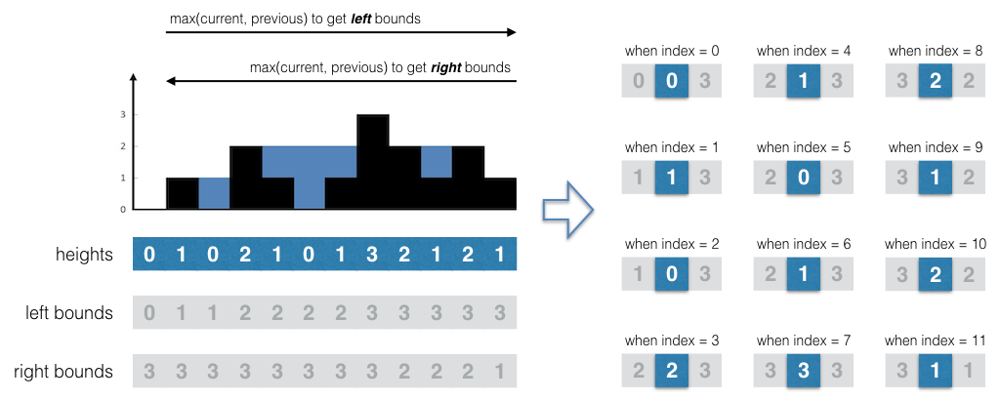

Question - [post](https://leetcode.com/problems/trapping-rain-water/)
--------

Given n non-negative integers representing an elevation map where the width of each bar is 1, compute how much water it is able to trap after raining.

For example:

Given `[0,1,0,2,1,0,1,3,2,1,2,1]`, return `6`.


---

Solution - [code](answer.py)
--------

**For each ground bar we get the highest ground level on its left and right side.**

* To get the highest ground level on its left side, we iterate through the heights array from left to right and save the maximum value of the current ground level and the previous highest ground level in another array, saying the `left bounds` array.
* To get the highest ground level on its right side, we iterate through the heights array from right to left and save the maximum value of the current ground level and the previous highest ground level in another array, saying the `right bounds` array.

With the `left bounds` and `right bounds` array, we're able to calculate the water level for every ground bar. The visual example is like:


 
The solution code is like:

```python
def trap(self, heights):
    if not heights or len(heights) < 3:
        return 0

    size = len(heights)
    lBound = [0] * size
    rBound = [0] * size

    h = heights[0]
    for i in range(size):
        lBound[i] = h = max(h, heights[i])

    h = heights[size - 1]
    for i in reversed(range(size)):
        rBound[i] = h = max(h, heights[i])

    water = 0
    for i in range(size):
        water += min(lBound[i], rBound[i]) - heights[i]

    return water
```

But there's a better way by doing with two pointers from the internet. My interpretation is ... **Because the water only leaks along the direction of the lower head and lower tail sides.** Using two pointers, where one is moving from the head of the array and the other one is moving from the tail of the array, we move the lower side close to the higher side and remember the highest ground level of the current side as the water level. By comparing the ground height of current side to the water level, we're able to accumulate the water volume.

```python
class Solution(object):
    def trap(self, heights):
        """
        :type heights: List[int]
        :rtype: int
        """
        if not heights or len(heights) < 3:
            return 0

        level = water = 0
        i = 0
        j = len(heights) - 1
        while i < j:
            # Take the lower side as the current ground level.
            it = heights[i if heights[i] < heights[j] else j]
            # Advance the lower side close to the higher side.
            if heights[i] < heights[j]:
                i += 1
            else:
                j -= 1

            if level > it:
                # If the ground level is lower than the water level, fill it
                # with the water.
                water += level - it
            else:
                # Update the water level.
                level = it
        return water
```

---

Application Sample
------------------

Yet know.
